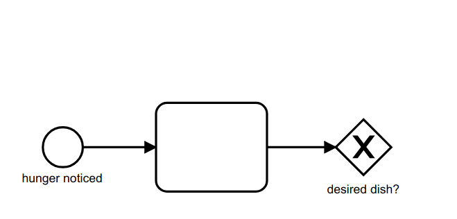

# entfrm-bpmn用于网络的 BPMN 2.0

[](https://github.com/bpmn-io/bpmn-js/actions?query=workflow%3ACI)

在浏览器中查看和编辑 BPMN 2.0 图表。

[](http://demo.bpmn.io/s/start)

## 安装

使用库 [pre-packaged](https://github.com/bpmn-io/bpmn-js-examples/tree/master/pre-packaged)
或者把它经由 [npm](https://github.com/bpmn-io/bpmn-js-examples/tree/master/bundling)
到您的节点式web应用程序中.

## 用法

首先，创建一个[bpmn-js](https://github.com/bpmn-io/bpmn-js) 实例
和渲染 [BPMN 2.0 diagrams](https://www.omg.org/spec/BPMN/2.0.2/) 在浏览器中:

开始

```javascript
const xml = '...'; // my BPMN 2.0 xml
const viewer = new BpmnJS({
  container: 'body'
});

try {
  const { warnings } = await viewer.importXML(xml);

  console.log('rendered');
} catch (err) {
  console.log('error rendering', err);
}
```

查看我们的[examples](https://github.com/bpmn-io/bpmn-js-examples) 以获得更多支持的使用场景.

### 动态 附加/分离

您也可以将查看器动态附加或分离到页面上的任何元素：

```javascript
const viewer = new BpmnJS();

// 将它附加到某个元素
viewer.attachTo('#container');

// 拆下面板
viewer.detach();
```

## 资源

* [演示](http://demo.bpmn.io)
* [问题](https://github.com/bpmn-io/bpmn-js/issues)
* [例子](https://github.com/bpmn-io/bpmn-js-examples)
* [论坛](https://forum.bpmn.io)

## 构建和运行

通过安装所有依赖项来准备项目：

```sh
npm install
```

然后，根据您的用例，您可以运行以下任何命令：

```sh
# 构建库并运行所有测试
npm run all

# 启动单个本地建模器实例
npm start

# 运行完整的开发设置
npm run dev
```

你可能需要开发 [额外的项目设置](./docs/project/SETUP.md) 当构建最新的开发快照时。

## 相关的

Bpmn-js构建在几个强大的工具之上:

* [bpmn-moddle](https://github.com/bpmn-io/bpmn-moddle): 浏览器中对BPMN 2.0 XML的读写支持
* [diagram-js](https://github.com/bpmn-io/diagram-js): 图表呈现和编辑工具包


